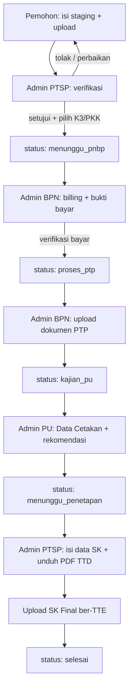
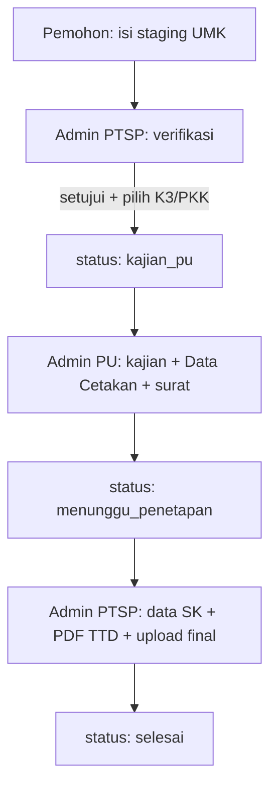

# Alur Pembuatan KKPR — SIPON Lampung Selatan

Dokumentasi lengkap alur **Kesesuaian Kegiatan Pemanfaatan Ruang (KKPR)** di aplikasi SIPON Lamsel: dari pendaftaran pemohon sampai SK terbit, termasuk peran admin, status, cetakan K3/PKK, dan file terkait di kode.

---

## 1. Ringkasan

KKPR di sistem ini mendukung dua jenis izin:

| Jenis | Kode | Jalur singkat |
|--------|------|----------------|
| **Non-Berusaha** | `non_berusaha` | Pemohon → PTSP (verifikasi) → **BPN** → **PU** → PTSP (penetapan SK) |
| **UMK** | `umk` | Pemohon → PTSP (verifikasi) → **PU** (langsung) → PTSP (penetapan SK) |

Saat verifikasi, Admin PTSP juga memilih **jenis cetakan**:

| Cetakan | Arti | Dokumen |
|---------|------|---------|
| **K3** | Konfirmasi (KKKPR) — berbasis **RDTR** | PDF FPDF + Word programatik |
| **PKK** | Persetujuan (PKKPR) — berbasis **RTR** | PDF FPDF + Word programatik |

> Unduh Word di UI penetapan saat ini **disembunyikan** (sementara); user memakai **Download PDF untuk TTD**, lalu upload SK Final ber-TTE.

---

## 2. Peran Pengguna

| Peran | Tugas utama |
|--------|-------------|
| **Pemohon** | Daftar / edit staging, upload syarat & peta, pantau status |
| **Admin PTSP (Adminkkpr)** | Verifikasi berkas staging, pilih K3/PKK, penetapan & terbitkan SK |
| **Admin BPN** | Billing PNBP, verifikasi bayar, upload dokumen PTP *(hanya Non-Berusaha)* |
| **Admin PU** | Kajian tata ruang, isi **Data Cetakan**, upload rekomendasi → teruskan ke penetapan |

---

## 3. Status Permohonan (`status_kkpr`)

Setelah staging **disetujui**, record masuk `tm_permohonan_kkpr` dengan status:

| Status | Arti | Actor berikutnya |
|--------|------|------------------|
| `menunggu_pnbp` | Menunggu pembayaran / billing BPN | Admin BPN |
| `proses_ptp` | Bayar verified; BPN proses PTP | Admin BPN |
| `kajian_pu` | Siap dikaji Dinas PU | Admin PU |
| `menunggu_penetapan` | Rekomendasi PU masuk; siap SK | Admin PTSP |
| `selesai` | SK Final diunggah & diterbitkan | — |

**Staging** (sebelum jadi permohonan aktif) memakai `status_verifikasi` di `tm_staging_kkpr`:

- `pending` / menunggu
- `perbaikan`
- `approved`
- `rejected`

---

## 4. Diagram Alur

### 4.1 Non-Berusaha



### 4.2 UMK



UMK **melewati BPN** (tidak ada `menunggu_pnbp` / `proses_ptp`).

---

## 5. Detail per Tahap

### 5.1 Pemohon — Pendaftaran (Staging)

**Modul:** `Kkpr` / `Kkprumk`  
**Tabel:** `tm_staging_kkpr`

Pemohon mengisi antara lain:

- Identitas & kontak (dari profil pemohon)
- Luas dimohon, rencana peruntukan, NPWP (jika ada)
- Titik koordinat / delineasi (GeoJSON)
- File syarat, peta ZIP, company profile (sesuai jenis)

Setelah dikirim, masuk antrian verifikasi PTSP.

---

### 5.2 Admin PTSP — Verifikasi Staging

**Modul:** `Adminkkpr` → Staging Non-Berusaha / UMK  
**View:** `adminkkpr/detail.php`

Saat **setujui**, wajib pilih:

- `jenis_cetakan` = `K3` atau `PKK`

Hasil:

- Staging → `approved`
- Buat / update `tm_permohonan_kkpr`
- Non-Berusaha → `menunggu_pnbp`
- UMK → `kajian_pu` (+ record `tm_kkpr_pu` jika belum ada)

Bisa juga **tolak** atau minta **perbaikan** (dengan alasan).

---

### 5.3 Admin BPN — PNBP & PTP (Non-Berusaha saja)

**Modul:** `Adminbpn`

1. **`menunggu_pnbp`**
   - Input / kelola billing
   - Pemohon unggah bukti bayar
   - Admin verifikasi bayar → status **`proses_ptp`**

2. **`proses_ptp`**
   - Upload dokumen PTP
   - Status → **`kajian_pu`**
   - Record `tm_kkpr_pu` disiapkan untuk Admin PU

---

### 5.4 Admin PU — Kajian & Data Cetakan

**Modul:** `Adminpu`  
**View:** `adminpu/detail.php` + partial `adminpu/partials/cetakan_workspace.php`

#### A. Data Cetakan (wajib sebelum terus ke PTSP)

Workspace bertahap:

| Section | Isi utama |
|---------|-----------|
| **Lokasi** | Alamat, desa, kecamatan, kab/kota, provinsi |
| **Kegiatan** | Jenis kegiatan; K3: sumber pendanaan; kedalaman min/max (opsional) |
| **Parameter** | KDB, KLB, KDH, GSB, KTB, jarak bebas, utilitas, indikasi program, persyaratan; opsional alasan penolakan (Lampiran II) |
| **Gambar Peta** | Muka peta delineasi, simbol/legenda, inset letak, muka peta K3/PKK |
| **Koordinat** | Tabel permukaan + bawah/atas tanah (JSON di DB) |

Catatan penting:

- Admin PU **tidak menolak status** di tahap ini. Menyimpan data cetakan **tidak** mengubah `status_kkpr`.
- Field “alasan penolakan / keterangan lain” hanya teks untuk **Lampiran II** cetakan.
- Setelah lengkap → unggah **rekomendasi / surat tata ruang** → status menjadi **`menunggu_penetapan`**.

#### B. Perbedaan field K3 vs PKK (Data Cetakan)

| Field | K3 | PKK |
|--------|----|-----|
| Sumber pendanaan | Ya (wajib di form) | Tidak |
| Rencana teknis bangunan | Tidak (di cetakan PKK poin 11 = teks tetap **Ada**) | Field UI dikunci “Ada” |
| Dasar ruang di cetakan | RDTR | RTR |

---

### 5.5 Admin PTSP — Penetapan SK

**Modul:** `Adminkkpr` → Penetapan  
**View:** `adminkkpr/detail_penetapan.php`

Alur UI yang disarankan:

1. **Isi & Simpan Data SK (Draf)**  
   Nomor SK, tanggal terbit, luas disetujui, peruntukan, no PTP BPN, no rekomendasi PU.  
   Status tetap `menunggu_penetapan`, `sk_status` = draf.

2. **Download PDF untuk TTD**  
   Cetakan K3/PKK tanpa watermark draf (endpoint `downloadCetakanPdfTtd`).  
   *(Tombol Word sengaja disembunyikan sementara di UI.)*

3. **Upload SK Final (PDF ber-TTE) & Terbitkan**  
   Wajib PDF. Status permohonan → **`selesai`**, `sk_status` = final.

---

## 6. Cetakan Dokumen (K3 & PKK)

### 6.1 Generator

| Output | K3 | PKK |
|--------|----|-----|
| **PDF** | `KkprK3Document` (FPDF) via `KkprFpdfCetakanService` | `KkprPkkDocument` (FPDF) |
| **Word** | `KkprK3WordDocument` (PhpWord) | `KkprPkkWordDocument` (PhpWord) |
| Data bersama | `KkprCetakanDataBuilder` | sama |

Endpoint terkait:

- `adminkkpr/downloadCetakan/{id}` — Word *(masih ada di backend; UI penetapan sementara tidak menampilkan)*
- `adminkkpr/downloadCetakanPdfTtd/{id}` — PDF siap TTD
- `adminkkpr/downloadCetakanPdf/{id}` — PDF draf (watermark) bila dipakai
- `adminkkpr/downloadSkFinal/{id}` — file SK final yang diunggah

### 6.2 Struktur isi singkat

**K3 (KKKPR / Konfirmasi — RDTR)**  
Badan surat + ketentuan + TTD/tembusan + Lampiran I (peta delineasi) + Lampiran II (zonasi/peta KKKPR + tabel koordinat).

**PKK (PKKPR / Persetujuan — RTR)**  
Halaman data pemohon & parameter → mempertimbangkan + ketentuan + TTD → halaman tembusan → Lampiran I (peta vs RTR) → halaman zonasi + muka peta PKKPR → Lampiran II (2 tabel koordinat dinamis).

Metadata peraturan (nomor/tahun RDTR–RTR, jabatan penandatangan, dll.) dari **Manajemen Template** (`trtemplate.meta_json`, jenis `KKPR_K3` / `KKPR_PKK`).

### 6.3 Logo

Urutan resolusi logo cetakan: `public/assets/images/logo.png`, fallback `logo_lamsel_ptsp.png`.

---

## 7. Tabel Database Utama

| Tabel | Fungsi |
|--------|--------|
| `tm_staging_kkpr` | Draf pengajuan sebelum verifikasi |
| `tm_permohonan_kkpr` | Permohonan aktif + `status_kkpr` + `jenis_cetakan` |
| `tm_kkpr_bpn` | Billing, bukti bayar, dokumen PTP |
| `tm_kkpr_pu` | Kajian PU + field cetakan + gambar + koordinat JSON |
| `tm_penetapan_kkpr` | Data SK, file final, `sk_status` |
| `trtemplate` | Meta peraturan / template jenis `KKPR_K3`, `KKPR_PKK` |

---

## 8. Route / Modul Referensi

| Area | Controller / path tipikal |
|------|---------------------------|
| Pemohon Non-Berusaha | `Kkpr` |
| Pemohon UMK | `Kkprumk` |
| Staging & penetapan PTSP | `Adminkkpr` (`staging`, `penetapan`, `detailPenetapan`, …) |
| BPN | `Adminbpn` |
| PU | `Adminpu` (`detail`, `simpanCetakan`, upload rekomendasi) |
| Manajemen Template | `Template` |

---

## 9. Checklist Operasional (cepat)

### PTSP — Verifikasi
- [ ] Berkas lengkap
- [ ] Pilih **K3** atau **PKK**
- [ ] Setujui / perbaikan / tolak

### BPN (Non-Berusaha)
- [ ] Billing & verifikasi bayar
- [ ] Upload PTP → ke PU

### PU
- [ ] Lengkapi semua section Data Cetakan bertanda `*`
- [ ] Upload gambar peta & koordinat (sesuai kebutuhan lampiran)
- [ ] Upload rekomendasi → status `menunggu_penetapan`

### PTSP — Penetapan
- [ ] Simpan data SK (draf)
- [ ] Unduh PDF TTD
- [ ] Upload PDF ber-TTE
- [ ] Terbitkan → `selesai`

### Manajemen Template
- [ ] Isi meta RDTR/RTR (nomor, tahun, kabupaten, jabatan, tempat ditetapkan)
- [ ] K3: meta cukup (file Word opsional)
- [ ] PKK: meta tetap dipakai generator programatik

---

## 10. File Kode Penting

```
app/Controllers/Kkpr.php / Kkprumk.php
app/Controllers/Adminkkpr.php
app/Controllers/Adminbpn.php
app/Controllers/Adminpu.php
app/Controllers/Template.php

app/Libraries/KkprCetakanDataBuilder.php
app/Libraries/KkprCetakanService.php
app/Libraries/KkprPdfCetakanService.php
app/Libraries/KkprFpdfCetakanService.php
app/Libraries/Fpdf/KkprK3Document.php
app/Libraries/Fpdf/KkprPkkDocument.php
app/Libraries/KkprK3WordDocument.php
app/Libraries/KkprPkkWordDocument.php

app/Views/adminpu/partials/cetakan_workspace.php
app/Views/adminkkpr/detail_penetapan.php

juknis/                    ← referensi juknis PDF/Word
```

---

## 11. Catatan Perilaku yang Sering Ditanyakan

1. **Apakah Admin PU bisa menolak permohonan?**  
   Belum sebagai aksi status. Hanya bisa isi catatan untuk lampiran, lalu tetap meneruskan ke PTSP.

2. **Siapa yang isi kedalaman / rencana teknis?**  
   Di sistem: **Admin PU** (form cetakan). Redaksi juknis “yang dimohon” bisa berasal dari pemohon di masa depan; saat ini belum ada di form pemohon.

3. **Poin 11 PKK “Rencana teknis…”**  
   Cetakan menampilkan tetap **Ada** (mengikuti contoh juknis).

4. **Tanggal “Diterbitkan tanggal” di cetakan PKK**  
   Menggunakan **tanggal hari file digenerate**, bukan otomatis menyalin field SK (kecuali disesuaikan lagi).

5. **Download Word di penetapan**  
   Sementara disembunyikan di UI; PDF TTD yang dipakai user.

---

## 12. Pengembangan Lanjutan (opsional)

- Aktifkan kembali tombol Word di penetapan jika klien meminta
- Field kedalaman / rencana teknis di form pemohon (lalu diverifikasi PU)
- Aksi formal “rekomendasi ditolak” di PU + flag ke PTSP
- Paritas penuh teks UMK (saat ini pipeline cetakan sama; redaksi masih Nonberusaha di banyak bagian)

---

*Dokumen ini menggambarkan perilaku aplikasi SIPON Lamsel sesuai implementasi kode saat dibuat. Sesuaikan jika alur bisnis atau regulasi daerah berubah.*
