# Panduan Penggunaan Modul Pencabutan SIP (Pemohon & Admin)

Dokumen ini adalah panduan langkah demi langkah untuk menggunakan fitur **Pencabutan Izin (SIP)** pada aplikasi SIPON Lamsel. Panduan ini mencakup alur dari sisi Pemohon (mengajukan pencabutan) hingga sisi Admin/Verifikator (menyetujui pencabutan).

---

## Bagian 1: Pemohon Mengajukan Pencabutan

### 1.1 Masuk ke Menu Pencabutan Izin
1. Login menggunakan akun **Pemohon**.
2. Pada menu navigasi utama, klik menu **Pencabutan Izin**.
3. Pastikan Anda berada di Tab **"Bisa Dicabut (Aktif)"**. Di sini akan tampil semua izin Anda yang sudah terbit dan aktif.

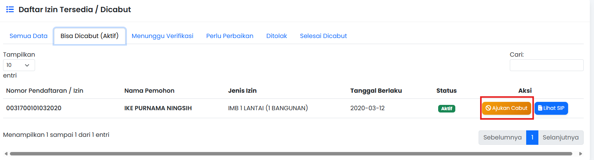

### 1.2 Mengisi Form Pengajuan Pencabutan
1. Pada salah satu data izin yang ingin dicabut, klik tombol kuning **"Ajukan Cabut"**.
2. Akan muncul form pengajuan. Silakan:
   - **Upload** berkas surat permohonan pencabutan (PDF/JPG/PNG).
   - **Isi Alasan Pencabutan** secara lengkap dan jelas.
3. Klik tombol **Ajukan Pencabutan**.

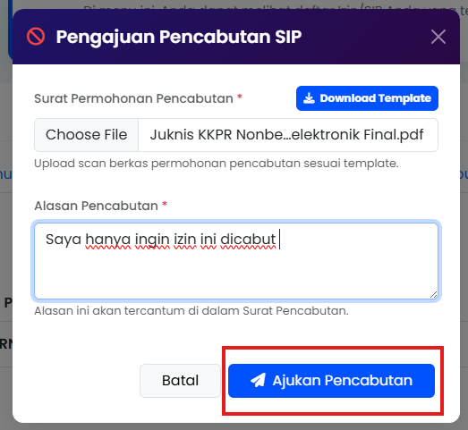

### 1.3 Memantau Status Pengajuan
1. Beralihlah ke Tab **"Menunggu Verifikasi"**.
2. Anda akan melihat status izin Anda berubah menjadi "Proses Cabut".
3. Klik tombol biru **"Detail"** untuk melihat ringkasan pengajuan Anda beserta status verifikasi saat ini.

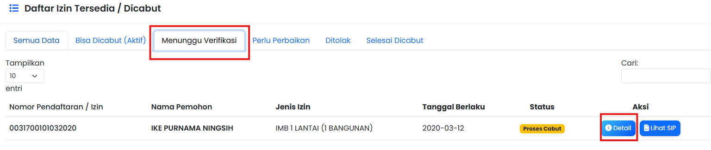

---

## Bagian 2: Admin Memproses Verifikasi

### 2.1 Mengecek Daftar Ajuan Baru
1. Login menggunakan akun **Admin / Verifikator**.
2. Masuk ke menu **Pencabutan Izin** dan klik Tab **"Menunggu Verifikasi"**.
3. Klik tombol **"Detail"** untuk membaca alasan pemohon dan melihat berkas yang mereka unggah.

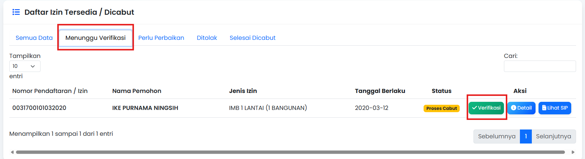

# detail
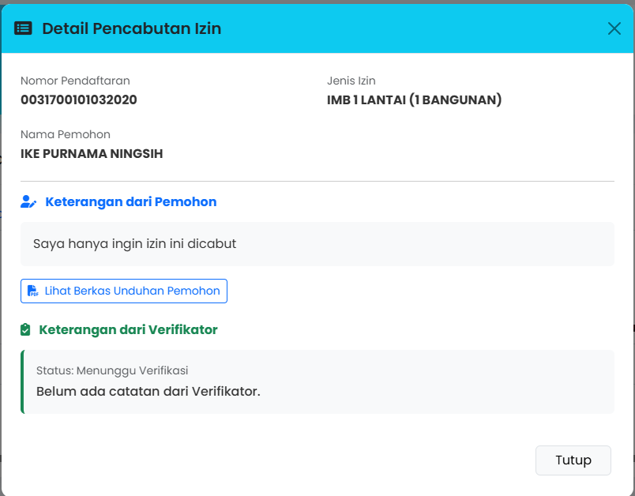

### 2.2 Memberikan Keputusan Verifikasi (Revisi / Tolak / Setuju)
1. Klik tombol hijau **"Verifikasi"** pada data tersebut.
2. Pada dropdown Aksi Verifikasi, Anda bisa memilih:
   - **Setujui Pencabutan:** Mengizinkan izin dicabut sepenuhnya.
   - **Perbaikan Berkas:** Mengembalikan ajuan ke pemohon (misal: karena berkas buram/salah).
   - **Tolak Pencabutan:** Menolak pengajuan.
3. Jika Anda memilih "Perbaikan" atau "Tolak", Anda **wajib** mengisi kolom **Catatan untuk Pemohon**.
4. Klik **Proses Verifikasi**.

# perbaikan berkas
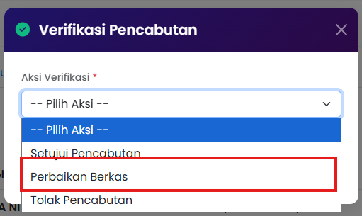

# form perbaikan untuk pemohon
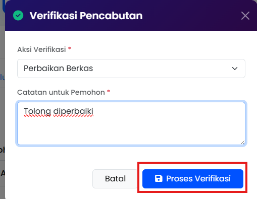

---

## Bagian 3: Pemohon Melakukan Revisi (Jika Diminta Perbaikan)

*Langkah ini hanya berlaku jika Admin memilih aksi "Perbaikan Berkas".*

1. Pemohon login dan masuk ke menu Pencabutan Izin.
2. Buka Tab **"Perlu Perbaikan"**.
3. Klik tombol **Detail** untuk melihat *Catatan dari Admin* (kotak hijau).
4. Klik tombol **Revisi Berkas**, lalu upload ulang dokumen yang sudah diperbaiki.
5. Status akan otomatis kembali menjadi "Menunggu Verifikasi".

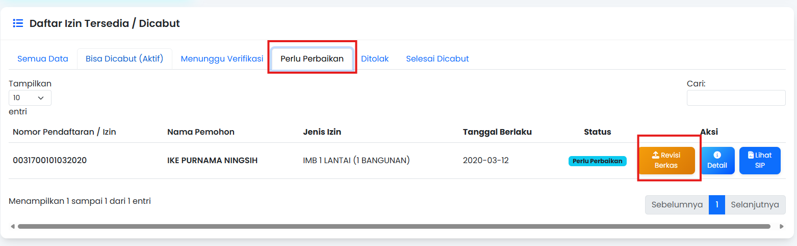

# upload ulang berkas dan keterangan
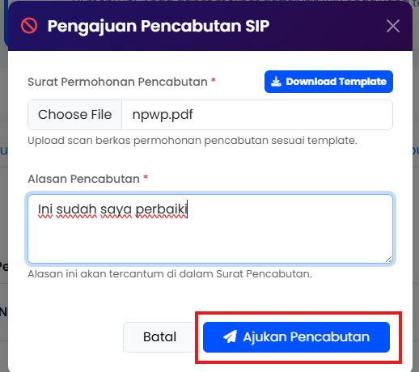

---

## Bagian 4: Hasil Akhir Izin Telah Dicabut

1. Setelah Admin menyetujui, izin akan berpindah ke Tab **"Selesai Dicabut"**.
2. **Perubahan pada Daftar Permohonan Utama:**
   - Masuk ke menu utama **Daftar Permohonan** (Permohonan Izin).
   - Cari data izin tersebut. Status pendaftaran kini ditandai dengan Badge Merah **"Dicabut"**.
   - Tombol "Cetak" SIP yang normal telah hilang dan digantikan dengan tombol merah **"Surat Cabut"**.

# izin dicabut
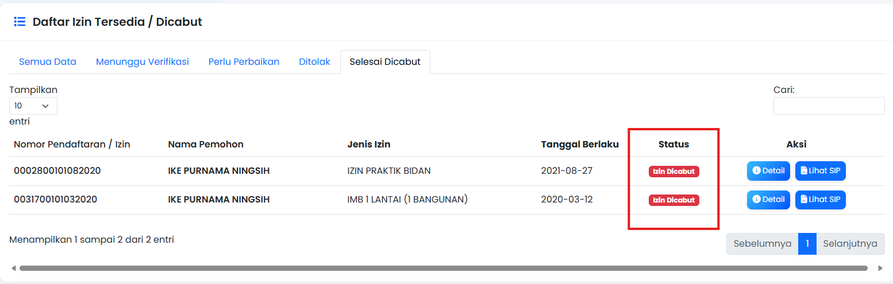

# izin ditolak
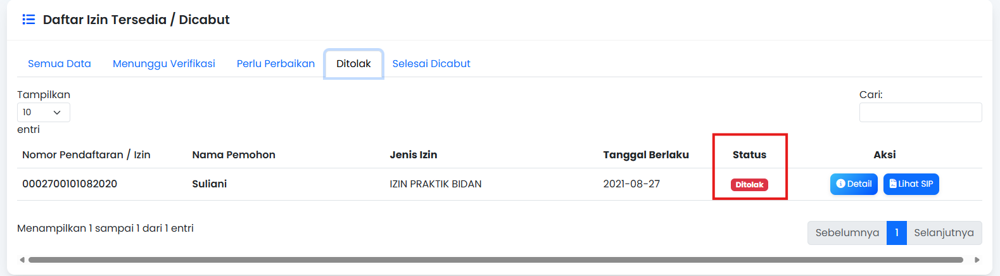